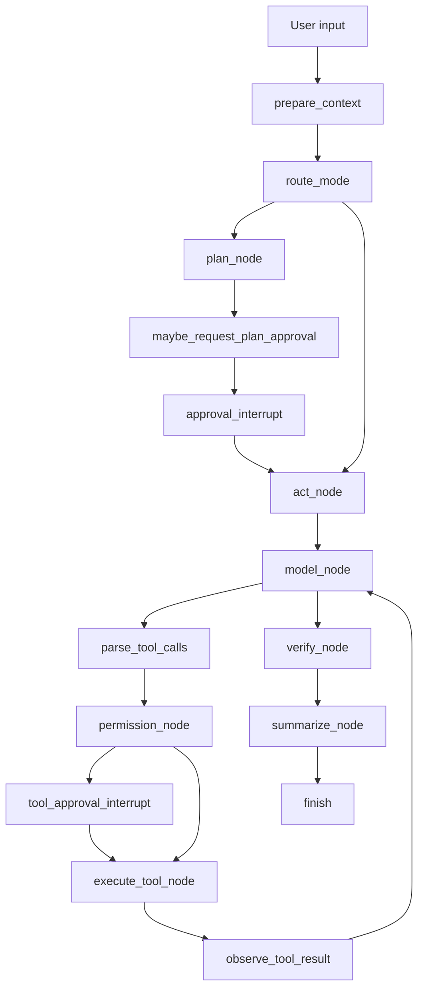

# LangGraph 重构后端实施方案

## 0. 文档目标

这份文档用于指导后续执行者将当前 `aiCoder` 后端逐步接入 LangGraph。

执行目标不是“把所有 Python 代码推倒重写”，而是：

1. 保留当前可工作的 CLI/TUI、工具层、RPC 层
2. 用 LangGraph 重构后端的 agent workflow 层
3. 把 `plan -> approval -> act -> verify -> summarize` 做成可暂停、可恢复、可测试的图流程
4. 最终让项目具备更接近 Claude Code 的后端运行时基础

本文档假设当前项目路径为：

```text
D:\CodingProject\aiCoder
```

当前后端主要目录：

```text
aicoder/
```

当前 TUI 前端目录：

```text
aicoder-tui/
```

---

## 1. 总体判断

### 1.1 是否建议全量重构

不建议一次性全量重构。

推荐采用渐进式接入：

```text
现有工具层 + 现有 RPC/TUI + 新增 LangGraph workflow 层
```

### 1.2 LangGraph 负责什么

LangGraph 主要负责：

1. Agent 主流程编排
2. Plan/Act 状态流转
3. 审批中断点
4. 工具调用循环
5. 失败恢复与重试策略
6. 会话 checkpoint
7. 后续多阶段任务扩展

### 1.3 LangGraph 不负责什么

LangGraph 不负责：

1. 文件读写工具本身
2. Shell 安全策略本身
3. Claude Code 式权限模式设计
4. TUI 前端展示
5. JSON-RPC 协议本身
6. 模型供应商封装本身

这些仍然由当前项目维护。

---

## 2. 当前项目模块分工

### 2.1 当前后端核心模块

| 模块 | 当前职责 | 重构策略 |
|---|---|---|
| `aicoder/main.py` | CLI 后端入口 | 保留 |
| `aicoder/rpc_io.py` | 与 TUI 的 JSON-RPC 通信 | 保留并扩展 |
| `aicoder/coders/base_coder.py` | 当前 agent 主循环与模型调用 | 部分迁移 |
| `aicoder/tools/executor.py` | 工具执行、权限、重试、摘要 | 部分拆分 |
| `aicoder/tools/handlers/*` | 具体工具实现 | 保留 |
| `aicoder/approval.py` | 自动审批与命令安全判断 | 保留并改造 |
| `aicoder/permission_modes.py` | 模式权限辅助 | 保留并扩展 |
| `aicoder/session.py` | 会话管理 | 保留，后续接 checkpoint |
| `aicoder/history.py` | 历史压缩 | 保留 |
| `aicoder/coders/message_builder.py` | 消息构建 | 部分迁移 |

### 2.2 当前前端核心模块

| 模块 | 当前职责 | 重构策略 |
|---|---|---|
| `aicoder-tui/src/rpc/*` | RPC 客户端 | 保留 |
| `aicoder-tui/src/hooks/useBackend.ts` | 后端事件绑定 | 保留并扩展 |
| `aicoder-tui/src/stores/chatStore.ts` | 聊天状态 | 保留 |
| `aicoder-tui/src/stores/configStore.ts` | 配置与模式状态 | 保留并扩展 |
| `aicoder-tui/src/stores/approvalStore.ts` | 审批状态 | 保留并扩展 |
| `aicoder-tui/src/components/approval/*` | 审批 UI | 后续增强 |
| `aicoder-tui/src/components/tools/*` | 工具卡片 | 后续增强 |

---

## 3. 目标架构

### 3.1 重构后的后端分层

推荐目标结构：

```text
aicoder/
  graph/
    __init__.py
    state.py
    nodes.py
    workflow.py
    interrupts.py
    checkpointer.py
    events.py
  agent_runtime.py
  permission_modes.py
  approval.py
  tools/
    executor.py
    handlers/
```

### 3.2 新旧职责划分

重构前：

```text
Coder.run()
  -> build messages
  -> call LLM
  -> parse tool XML
  -> execute tools
  -> append results
  -> loop
```

重构后：

```text
AgentRuntime.run_user_turn()
  -> LangGraph graph.invoke()/stream()
  -> graph nodes handle model/tool/approval/summary
  -> emit events to rpc_io
```

### 3.3 推荐流程图



---

## 4. 依赖接入

### 4.1 修改 `pyproject.toml`

新增依赖：

```toml
dependencies = [
  "langgraph>=0.2.0",
  "langchain-core>=0.3.0"
]
```

如果当前依赖格式不是数组，请按现有项目风格加入。

### 4.2 安装验证

在项目根目录运行：

```powershell
pip install -e .
python -c "import langgraph; print('langgraph ok')"
```

### 4.3 注意

不要一开始引入完整 `langchain` 大包，优先只使用：

```text
langgraph
langchain-core
```

原因：

1. 当前项目已经有自己的模型封装
2. 当前项目已经有自己的工具系统
3. 先减少依赖面，避免迁移复杂度失控

---

## 5. Graph State 设计

### 5.1 新增文件

新建：

```text
aicoder/graph/state.py
```

### 5.2 推荐 State 字段

```python
from __future__ import annotations

from typing import Any, Literal, TypedDict


PermissionMode = Literal["default", "acceptEdits", "plan", "bypassPermissions", "act"]
RunPhase = Literal[
    "idle",
    "preparing",
    "planning",
    "waiting_approval",
    "acting",
    "tool_running",
    "verifying",
    "summarizing",
    "done",
    "error",
]


class ApprovalRequest(TypedDict, total=False):
    id: str
    kind: Literal["plan", "tool", "command"]
    title: str
    body: str
    tool_name: str
    params: dict[str, Any]
    diff: str
    mode: PermissionMode


class ToolObservation(TypedDict, total=False):
    tool_name: str
    params: dict[str, Any]
    success: bool
    output: str
    error: str
    rejected: bool


class AgentGraphState(TypedDict, total=False):
    session_id: str
    user_input: str
    messages: list[dict[str, Any]]
    mode: PermissionMode
    phase: RunPhase
    root: str
    current_plan: str
    approved_plan: str
    approval_request: ApprovalRequest
    approval_response: bool
    pending_tool_calls: list[dict[str, Any]]
    tool_observations: list[ToolObservation]
    final_response: str
    error: str
    loop_count: int
    max_loops: int
```

### 5.3 设计原则

1. Graph state 是流程状态，不是 UI store
2. 工具真实实现仍然在 `tools/handlers`
3. `messages` 继续兼容当前模型调用格式
4. `mode` 后续逐步从 `act/plan` 扩展到 Claude Code 风格多模式
5. `approval_request` 是 human-in-the-loop 的核心桥接字段

---

## 6. Graph 事件设计

### 6.1 新增文件

新建：

```text
aicoder/graph/events.py
```

### 6.2 推荐事件类型

```python
from __future__ import annotations

from dataclasses import dataclass, field
from typing import Any, Literal


GraphEventType = Literal[
    "phase",
    "mode",
    "assistant_token",
    "assistant_final",
    "tool_started",
    "tool_finished",
    "approval_requested",
    "approval_resolved",
    "error",
]


@dataclass
class GraphEvent:
    type: GraphEventType
    payload: dict[str, Any] = field(default_factory=dict)
```

### 6.3 与现有 RPC 映射

| Graph Event | 当前 RPC 事件 |
|---|---|
| `assistant_token` | `stream/token` |
| `assistant_final` | `stream/finalize` |
| `tool_started` | `tool/call_started` |
| `tool_finished` | `tool/call_finished` |
| `approval_requested` | `approval/request` |
| `phase` | 新增 `status/phase` 或复用 `status/update` |
| `mode` | `status/update` |
| `error` | `error` |

第一阶段可以先复用当前事件，减少前端改动。

---

## 7. Graph Nodes 设计

### 7.1 新增文件

新建：

```text
aicoder/graph/nodes.py
```

### 7.2 节点清单

第一阶段建议实现这些节点：

| 节点 | 职责 |
|---|---|
| `prepare_context` | 构建系统消息、文件上下文、当前模式附件 |
| `route_mode` | 根据 mode 路由到 plan 或 act |
| `plan_node` | 生成计划，不执行修改 |
| `request_plan_approval` | 将计划变成审批请求 |
| `model_node` | 调用现有模型生成回复 |
| `parse_tool_calls` | 解析 XML 工具调用 |
| `permission_node` | 调用现有权限系统决定 allow/ask/deny |
| `execute_tool_node` | 调用现有 ToolExecutor 或 handler |
| `observe_tool_result` | 把工具结果写回 messages |
| `verify_node` | 可选，跑测试或检查 |
| `summarize_node` | 输出最终总结 |

### 7.3 第一阶段不要做的节点

第一阶段不要做：

1. 多 agent 节点
2. 自动 classifier 节点
3. 远程执行节点
4. 云端 sandbox 节点
5. 复杂 memory 检索节点

先让主流程跑稳。

---

## 8. Workflow 设计

### 8.1 新增文件

新建：

```text
aicoder/graph/workflow.py
```

### 8.2 推荐代码骨架

```python
from __future__ import annotations

from langgraph.graph import END, StateGraph

from .state import AgentGraphState
from .nodes import (
    execute_tool_node,
    model_node,
    observe_tool_result,
    parse_tool_calls,
    permission_node,
    plan_node,
    prepare_context,
    request_plan_approval,
    route_after_model,
    route_after_permission,
    route_mode,
    summarize_node,
)


def build_agent_graph():
    graph = StateGraph(AgentGraphState)

    graph.add_node("prepare_context", prepare_context)
    graph.add_node("plan", plan_node)
    graph.add_node("request_plan_approval", request_plan_approval)
    graph.add_node("model", model_node)
    graph.add_node("parse_tool_calls", parse_tool_calls)
    graph.add_node("permission", permission_node)
    graph.add_node("execute_tool", execute_tool_node)
    graph.add_node("observe_tool_result", observe_tool_result)
    graph.add_node("summarize", summarize_node)

    graph.set_entry_point("prepare_context")

    graph.add_conditional_edges(
        "prepare_context",
        route_mode,
        {
            "plan": "plan",
            "act": "model",
        },
    )

    graph.add_edge("plan", "request_plan_approval")
    graph.add_edge("request_plan_approval", END)

    graph.add_conditional_edges(
        "model",
        route_after_model,
        {
            "tools": "parse_tool_calls",
            "finish": "summarize",
        },
    )

    graph.add_edge("parse_tool_calls", "permission")

    graph.add_conditional_edges(
        "permission",
        route_after_permission,
        {
            "execute": "execute_tool",
            "approval": END,
            "deny": "summarize",
        },
    )

    graph.add_edge("execute_tool", "observe_tool_result")
    graph.add_edge("observe_tool_result", "model")
    graph.add_edge("summarize", END)

    return graph.compile()
```

### 8.3 注意

第一版可以先不用 LangGraph interrupt API，先用 `END + approval_request` 暂停。

第二版再引入正式 interrupt/resume。

原因：

1. 当前 RPC 审批机制已经是阻塞等待
2. 直接接 interrupt 会同时改太多
3. 先让 Graph 状态流跑通更重要

---

## 9. Human-in-the-loop 设计

### 9.1 第一阶段方案

第一阶段使用现有 `rpc_io.approval_request()`。

流程：

```text
permission_node 判断 ask
  -> 生成 approval_request
  -> AgentRuntime 调用 io.approval_request()
  -> 用户批准
  -> 继续调用 execute_tool_node
```

### 9.2 第二阶段方案

第二阶段使用 LangGraph interrupt。

流程：

```text
permission_node
  -> interrupt(approval_request)
  -> TUI 展示审批
  -> 用户响应
  -> graph resume
  -> 继续执行
```

### 9.3 审批请求格式

建议统一为：

```json
{
  "id": "uuid",
  "kind": "tool",
  "title": "Allow tool call?",
  "body": "edit_file wants to modify a file",
  "tool_name": "edit_file",
  "params": {},
  "diff": "",
  "mode": "act"
}
```

### 9.4 前端暂时兼容策略

当前前端 `approval/request` 只需要：

```ts
{
  id: string;
  question: string;
  diff?: string;
}
```

所以后端第一阶段可以把结构化请求降级成：

```python
question = f"{title}\n\n{body}"
diff = request.get("diff")
```

---

## 10. AgentRuntime 适配层

### 10.1 新增文件

新建：

```text
aicoder/agent_runtime.py
```

### 10.2 作用

`AgentRuntime` 是当前 `Coder` 和 LangGraph 之间的适配器。

它负责：

1. 保存 `coder`
2. 构造初始 graph state
3. 调用 graph
4. 把 graph 事件转成现有 IO 调用
5. 兼容现有 `Coder.run()` 返回值

### 10.3 推荐代码骨架

```python
from __future__ import annotations

from typing import Any

from .graph.workflow import build_agent_graph


class AgentRuntime:
    def __init__(self, coder):
        self.coder = coder
        self.graph = build_agent_graph()

    def run_user_turn(self, user_input: str) -> str | None:
        state = self._initial_state(user_input)
        result = self.graph.invoke(state)
        final_response = result.get("final_response")
        return final_response

    def _initial_state(self, user_input: str) -> dict[str, Any]:
        mode = "plan" if self.coder.tool_exec_state.is_plan_mode else "act"
        return {
            "session_id": self.coder.session_id or "",
            "user_input": user_input,
            "messages": list(self.coder.done_messages + self.coder.cur_messages),
            "mode": mode,
            "phase": "preparing",
            "root": self.coder.root,
            "pending_tool_calls": [],
            "tool_observations": [],
            "loop_count": 0,
            "max_loops": 5,
        }
```

### 10.4 集成点

在 `aicoder/coders/base_coder.py` 中，不要立刻删除旧逻辑。

新增 feature flag：

```python
USE_LANGGRAPH_RUNTIME = os.environ.get("AICODER_LANGGRAPH_RUNTIME") == "1"
```

然后在 `Coder.run()` 开头分流：

```python
if USE_LANGGRAPH_RUNTIME:
    from ..agent_runtime import AgentRuntime
    return AgentRuntime(self).run_user_turn(with_message)
```

这样可以通过环境变量灰度切换。

---

## 11. 与现有 Coder 的迁移策略

### 11.1 第一阶段保留 Coder

第一阶段不要删除：

```text
aicoder/coders/base_coder.py
```

只做：

1. 增加 LangGraph runtime 分支
2. 保留原有 run 逻辑
3. 用环境变量控制是否启用

### 11.2 第二阶段抽出公共能力

从 `Coder` 抽出这些方法给 LangGraph 节点复用：

| 当前方法 | 建议抽出位置 |
|---|---|
| `_update_tool_model_info` | 保留 |
| `get_repo_map` | 保留 |
| `_build_workspace_info` | 保留 |
| `_build_file_tree` | 保留 |
| `_detect_cli_tools` | 保留 |
| `_trim_context_for_model` | 后续迁移 |
| `auto_commit` | 后续作为 graph node |

### 11.3 第三阶段再收敛

等 LangGraph runtime 稳定后，再考虑：

1. 删除旧 run loop
2. 将 `Coder` 变成上下文容器
3. 将 agent workflow 完全交给 LangGraph

---

## 12. 工具执行迁移方案

### 12.1 第一阶段

第一阶段继续复用：

```text
aicoder/tools/executor.py
```

在 LangGraph 节点中调用：

```python
result = coder.tool_executor.execute(tool_call)
```

原因：

1. 当前工具执行器已经处理权限、超时、重试
2. 一开始不要同时迁工具执行和主循环
3. 降低行为回归风险

### 12.2 第二阶段

把 `ToolExecutor` 拆成：

```text
aicoder/tools/permission_pipeline.py
aicoder/tools/execution_pipeline.py
aicoder/tools/result_presenter.py
```

其中：

| 新模块 | 职责 |
|---|---|
| `permission_pipeline.py` | 权限判断 |
| `execution_pipeline.py` | 真正执行工具 |
| `result_presenter.py` | UI 与上下文摘要 |

### 12.3 第三阶段

将工具执行节点 LangGraph 化：

```text
permission_node
tool_approval_node
execute_tool_node
observe_tool_result_node
```

---

## 13. 模式系统迁移方案

### 13.1 当前状态

当前项目已经有：

```text
aicoder/permission_modes.py
```

当前主要模式：

```text
plan
act
```

### 13.2 目标模式

后续应扩展为：

```text
default
acceptEdits
plan
bypassPermissions
```

暂时不要做：

```text
auto
dontAsk
```

### 13.3 LangGraph 中的模式字段

Graph state 里统一使用：

```python
state["mode"]
```

不要让模式只存在于：

```python
coder.tool_exec_state.mode
```

### 13.4 同步策略

每轮开始：

```python
state["mode"] = coder.tool_exec_state.mode
```

每轮结束：

```python
coder.tool_exec_state.mode = state["mode"]
```

RPC 更新：

```python
io._notify("status/update", {
    "mode": state["mode"],
    "planMode": state["mode"] == "plan",
})
```

---

## 14. 消息构建迁移方案

### 14.1 当前模块

当前消息构建在：

```text
aicoder/coders/message_builder.py
```

### 14.2 第一阶段

LangGraph 节点直接复用：

```python
from aicoder.coders.message_builder import format_messages
```

### 14.3 第二阶段

拆出：

```text
aicoder/messages/system.py
aicoder/messages/context.py
aicoder/messages/mode_attachments.py
aicoder/messages/compact.py
```

### 14.4 目标

最终形成：

```text
base system prompt
tool prompt
mode attachment
workspace attachment
session messages
tool observations
```

这更接近 Claude Code 的提示注入方式。

---

## 15. Checkpoint 与会话持久化

### 15.1 第一阶段

第一阶段不启用复杂 checkpoint。

理由：

1. 当前项目已有 session
2. 先让流程跑通
3. checkpoint 会引入新的状态一致性问题

### 15.2 第二阶段

引入 LangGraph checkpointer。

推荐先用 SQLite：

```text
~/.aicoder/langgraph/checkpoints.sqlite
```

### 15.3 状态恢复原则

恢复时必须保证：

1. 当前模式恢复
2. 当前 messages 恢复
3. pending approval 恢复
4. pending tool 不自动重复执行危险操作

### 15.4 高风险点

不要在 checkpoint resume 后自动重复执行：

1. `run_shell`
2. `write_file`
3. `edit_file`

必须通过 tool id 或 approval id 做幂等保护。

---

## 16. RPC 改造方案

### 16.1 第一阶段

保持当前 RPC 基本不变。

继续使用：

```text
stream/token
stream/finalize
tool/call_started
tool/call_finished
approval/request
status/update
error
```

### 16.2 新增建议事件

第二阶段新增：

```text
status/phase
plan/request
plan/approved
plan/rejected
graph/checkpoint
```

### 16.3 `status/update` 扩展字段

建议：

```json
{
  "model": "xxx",
  "mode": "plan",
  "planMode": true,
  "phase": "planning",
  "checkpointId": "xxx"
}
```

### 16.4 前端兼容

前端先忽略未知字段。

不要在第一阶段强制大改 TUI。

---

## 17. 前端最小改造

### 17.1 第一阶段必须改

前端只需要确保可以显示：

1. 当前 mode
2. 当前 phase
3. 审批请求

涉及文件：

```text
aicoder-tui/src/stores/configStore.ts
aicoder-tui/src/hooks/useBackend.ts
aicoder-tui/src/components/layout/StatusBar.tsx
aicoder-tui/src/stores/approvalStore.ts
```

### 17.2 第二阶段再增强

第二阶段增强：

1. Plan approval UI
2. Tool approval UI
3. Graph phase display
4. Tool result expandable view

---

## 18. 分阶段执行计划

## 阶段 1：接入 LangGraph 但默认关闭

目标：

```text
项目安装 LangGraph，新 runtime 可导入，但不影响现有运行路径
```

任务：

1. 修改 `pyproject.toml` 加依赖
2. 新增 `aicoder/graph/__init__.py`
3. 新增 `aicoder/graph/state.py`
4. 新增 `aicoder/graph/events.py`
5. 新增 `aicoder/graph/workflow.py`
6. 新增 `aicoder/graph/nodes.py`
7. 新增 `aicoder/agent_runtime.py`
8. 在 `Coder.run()` 加环境变量分支

验收：

```powershell
pytest aicoder/tests -q
python -c "from aicoder.graph.workflow import build_agent_graph; print(build_agent_graph())"
```

成功标准：

1. 不开环境变量时行为完全走旧路径
2. 所有现有测试通过
3. Graph 可以构建

---

## 阶段 2：迁移 plan 流程

目标：

```text
LangGraph runtime 可以处理 /plan 模式下的用户请求，生成计划但不执行修改
```

任务：

1. 实现 `prepare_context`
2. 实现 `route_mode`
3. 实现 `plan_node`
4. 实现 `request_plan_approval`
5. 将 `current_plan` 写入 state
6. 将 plan 输出通过现有 stream/finalize 发给前端

验收：

```powershell
$env:AICODER_LANGGRAPH_RUNTIME="1"
python run.py
```

手工测试：

```text
/plan
分析这个项目的工具系统，不要修改文件
```

成功标准：

1. 不调用 `edit_file`
2. 不调用 `write_file`
3. 输出结构化计划
4. TUI 显示仍正常

---

## 阶段 3：迁移 act 工具循环

目标：

```text
LangGraph runtime 可以调用现有工具执行器完成读文件、改文件、跑命令
```

任务：

1. 实现 `model_node`
2. 实现 `parse_tool_calls`
3. 实现 `permission_node`
4. 实现 `execute_tool_node`
5. 实现 `observe_tool_result`
6. 支持工具循环最大次数限制

关键约束：

```python
state["loop_count"] <= state["max_loops"]
```

验收：

手工测试：

```text
/act
读取 README.md，并把内容改成一句更完整的项目介绍
```

成功标准：

1. 能读取文件
2. 能写文件
3. 能把工具结果写回 messages
4. 能最终总结
5. 没有无限循环

---

## 阶段 4：迁移审批中断点

目标：

```text
LangGraph runtime 能在危险操作或需要权限时暂停并等待用户审批
```

任务：

1. 在 `permission_node` 中生成 approval request
2. 使用现有 `io.approval_request()`
3. 用户批准后继续执行
4. 用户拒绝后写入 rejected observation
5. 前端保持当前审批 UI

验收：

手工测试：

```text
/act
运行 git reset --hard
```

成功标准：

1. 必须弹审批
2. 拒绝后不能执行
3. 拒绝结果写入 messages
4. agent 能继续解释下一步

---

## 阶段 5：引入 checkpoint

目标：

```text
LangGraph runtime 支持会话级 checkpoint
```

任务：

1. 新增 `aicoder/graph/checkpointer.py`
2. 使用 SQLite checkpointer
3. checkpoint id 与 session id 绑定
4. pending approval 可恢复
5. 防止恢复后重复执行写操作

验收：

手工测试：

1. 发起一个需要审批的操作
2. 停止进程
3. 重启
4. 恢复 session
5. 确认审批状态仍可处理

成功标准：

1. 不丢 pending approval
2. 不重复执行工具
3. 模式状态正确恢复

---

## 阶段 6：清理旧 runtime

目标：

```text
LangGraph runtime 稳定后，逐步减少旧 agent loop 职责
```

任务：

1. 把旧 `Coder.run()` 的 LLM/tool loop 标记为 legacy
2. 将工具执行、消息构建、权限判断拆成可复用模块
3. 默认启用 LangGraph runtime
4. 保留环境变量回退旧 runtime
5. 补齐回归测试

成功标准：

1. 默认路径可用
2. 旧路径可回退
3. 常见任务测试通过

---

## 19. 测试计划

### 19.1 单元测试

新增测试文件：

```text
aicoder/tests/test_graph_state.py
aicoder/tests/test_graph_workflow.py
aicoder/tests/test_agent_runtime.py
aicoder/tests/test_graph_permissions.py
```

### 19.2 必测场景

| 场景 | 预期 |
|---|---|
| plan 模式请求改文件 | 不执行，输出计划 |
| act 模式读取文件 | 成功调用 read_file |
| act 模式写文件 | 成功调用 write_file 或 edit_file |
| plan 模式执行危险 shell | 拒绝或审批 |
| act 模式执行危险 shell | 审批 |
| 用户拒绝审批 | 不执行工具 |
| 工具失败 | 写入 observation |
| 连续工具调用超过上限 | 停止循环 |
| Graph 构建 | 成功 |
| 不启用环境变量 | 旧路径不变 |

### 19.3 回归测试命令

```powershell
pytest aicoder/tests -q
```

### 19.4 前端验证

```powershell
cd aicoder-tui
cmd /c npm run typecheck
```

注意：

当前前端可能已有既存 TS 错误。执行者需要区分：

1. 迁移引入的新错误
2. 迁移前已经存在的错误

---

## 20. 风险清单

### 20.1 高风险

| 风险 | 说明 | 缓解 |
|---|---|---|
| 工具重复执行 | checkpoint resume 后重复写文件或跑命令 | 工具调用加 id，写操作恢复时必须重新审批 |
| 审批状态丢失 | 中断后无法继续 | approval_request 写入 state 和 session |
| 消息历史错乱 | Graph state 与 Coder messages 不一致 | 每轮结束统一 sync |
| TUI 协议破坏 | 前端无法显示 | 第一阶段不改事件名 |
| 行为回归 | 原有 CLI 不可用 | 环境变量灰度 |

### 20.2 中风险

| 风险 | 说明 | 缓解 |
|---|---|---|
| 代码复杂度增加 | 新旧 runtime 并存 | 明确阶段边界 |
| 测试变慢 | Graph 测试启动成本更高 | mock 模型和工具 |
| 模型消息格式不兼容 | 现有 LLM 封装非 LangChain 模型 | 不使用 LangChain model wrapper，继续调用现有 `Model` |

---

## 21. 回滚策略

必须保留环境变量开关：

```powershell
$env:AICODER_LANGGRAPH_RUNTIME="1"
```

默认关闭，直到阶段 6。

如果出问题：

```powershell
Remove-Item Env:AICODER_LANGGRAPH_RUNTIME
```

或：

```powershell
$env:AICODER_LANGGRAPH_RUNTIME="0"
```

回滚要求：

1. 旧 runtime 代码保留
2. 旧测试保持通过
3. 新 runtime 不能改坏旧工具 handler

---

## 22. 给执行者的具体任务顺序

请严格按以下顺序执行。

### 任务 1：准备依赖和空模块

修改：

```text
pyproject.toml
```

新增：

```text
aicoder/graph/__init__.py
aicoder/graph/state.py
aicoder/graph/events.py
aicoder/graph/nodes.py
aicoder/graph/workflow.py
aicoder/agent_runtime.py
```

执行：

```powershell
pytest aicoder/tests -q
```

### 任务 2：实现最小 Graph

实现：

```text
prepare_context
route_mode
plan_node
summarize_node
build_agent_graph
```

要求：

1. Graph 可 compile
2. Graph 可 invoke
3. 不调用真实工具

### 任务 3：接入 Coder.run 灰度分支

修改：

```text
aicoder/coders/base_coder.py
```

要求：

1. 默认不启用 LangGraph
2. 设置 `AICODER_LANGGRAPH_RUNTIME=1` 后启用
3. 旧测试必须通过

### 任务 4：接入现有模型调用

在 `model_node` 中复用：

```python
coder.main_model.send_completion(...)
coder.main_model.simple_send(...)
```

不要强制改成 LangChain model。

### 任务 5：接入工具解析

复用：

```text
aicoder/tools/parser.py
```

将解析出的 `ToolCall` 写入：

```python
state["pending_tool_calls"]
```

### 任务 6：接入工具执行

复用：

```python
coder.tool_executor.execute(tool_call)
```

把结果写入：

```python
state["tool_observations"]
state["messages"]
```

### 任务 7：接入审批

先复用：

```python
coder.io.approval_request(...)
```

暂时不要马上使用 LangGraph interrupt。

### 任务 8：补测试

至少补：

```text
test_graph_workflow_builds
test_graph_plan_mode_does_not_execute_tools
test_graph_act_mode_executes_read_tool
test_graph_denied_tool_writes_observation
test_langgraph_runtime_disabled_by_default
```

---

## 23. 第一版最小可用定义

第一版 LangGraph runtime 只要做到这些就算成功：

1. 设置环境变量后能进入 LangGraph runtime
2. plan 模式能生成计划
3. act 模式能调用至少一个 read 工具
4. act 模式能执行一次 write/edit 工具
5. 工具结果能回到模型上下文
6. 审批拒绝不会执行工具
7. 不启用环境变量时旧路径完全可用

不要在第一版追求：

1. checkpoint
2. 完整 interrupt/resume
3. 多 agent
4. auto mode
5. LangSmith
6. Chainlit

---

## 24. 第二版增强定义

第二版再做：

1. LangGraph interrupt
2. SQLite checkpoint
3. plan approval 专用 UI
4. 工具调用幂等 id
5. 恢复 pending approval
6. mode 状态机扩展到 `default / acceptEdits / plan / bypassPermissions`

---

## 25. 最终建议

这次重构应该遵循一个原则：

```text
先把 LangGraph 作为 workflow 层接进来，再逐步替代旧 agent loop。
```

不要一开始替换：

1. 工具 handler
2. RPC 通信
3. TUI 前端
4. 模型封装
5. session 全部逻辑

最优路径是：

```text
旧系统可运行
  -> 新 Graph 可构建
  -> 新 Graph 可 plan
  -> 新 Graph 可 act
  -> 新 Graph 可审批
  -> 新 Graph 可 checkpoint
  -> 默认切换到新 runtime
```

这样既能利用 LangGraph 的优势，又能最大程度保护当前项目已有功能。
